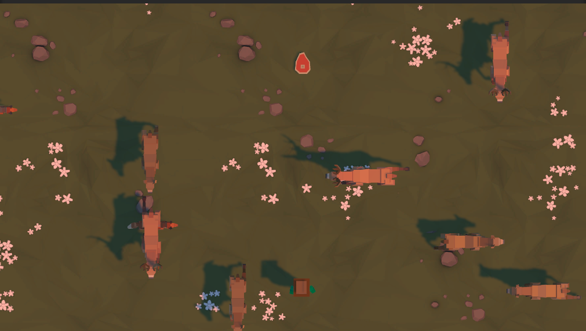
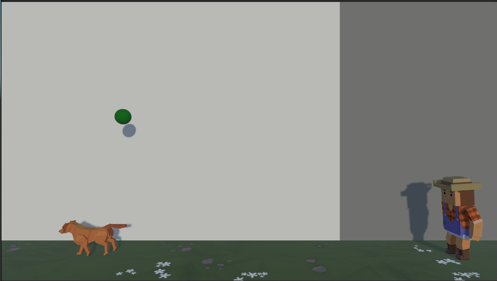

# Feed Frenzy Game Project & Catch The Ball Game Project(Catch The Ball Game project is a challenge project, which means it's not the focus of this project)

## Feed Frenzy

- Feed Frenzy is an engaging game set in a bird's-eye view perspective. The player's objective is to feed approaching animals from the front, right, and left sides before they exit the camera angle. Losing occurs if 3 animals leave the camera view. Points are scored by successfully feeding the animals with tossed food using the space bar.

### Controls
- WASD: Movement of the player character.
- Space: Throw food.

### Animals
- Approach from the front, right, and left sides. Move straight.
- Exit the camera angle after a certain time.

### Food
- Thrown using the Space key.
- Awards points and feeds animals when caught.

### Game Progression
- The more animals the player feeds, the higher the score.
- If 3 animals exit the camera angle, the game is lost.

### Scoring
- Earn points for each fed animal.
- A score table keeps track of the number of lost games.

### ScreenShot

## Catch The Ball

- Catch the Ball is a straightforward and fun game where players use the space bar to control a dog that spawns and runs forward. The game adopts a side-view camera angle, and the player's objective is to catch balls falling from above by spawning dogs with the space bar.

### Controls
- Space: Spawn a Dog

### Dog
- Spawns when the space bar is pressed.
- Runs forward automatically.

### Balls
- Fall from the top of the screen.
- Player must use spawned dogs to catch the falling balls.

### Game Progression
- Balls fall continuously from the top.
- Each caught ball contributes to the player's score.
- Missing 3 balls causes the game over.

### ScreenShot

